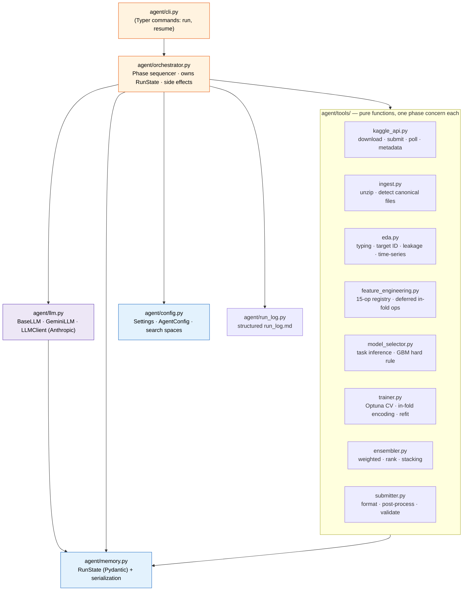
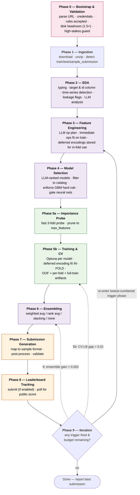
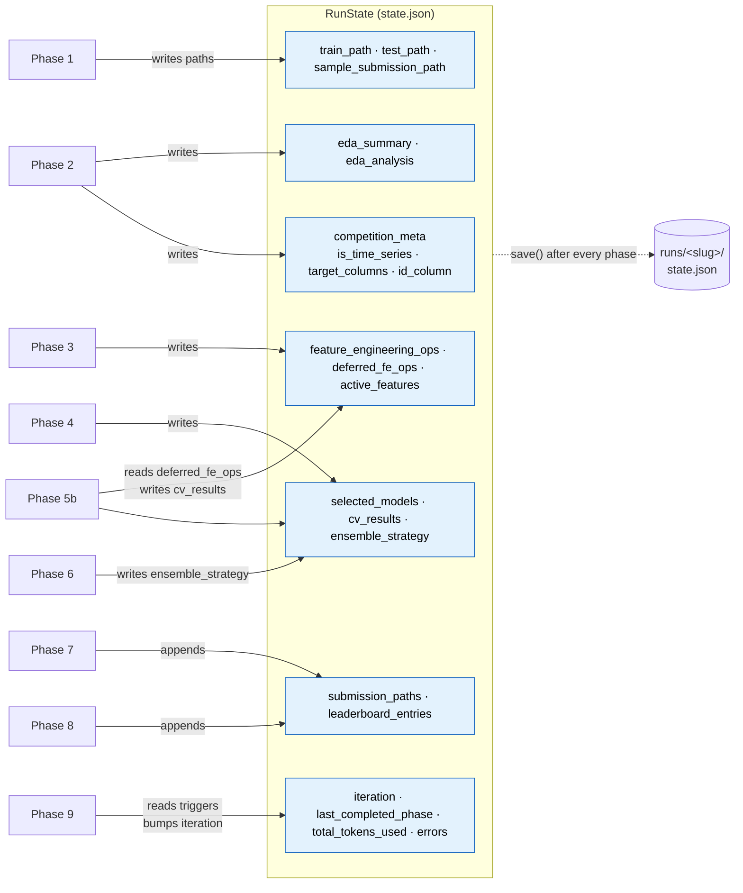
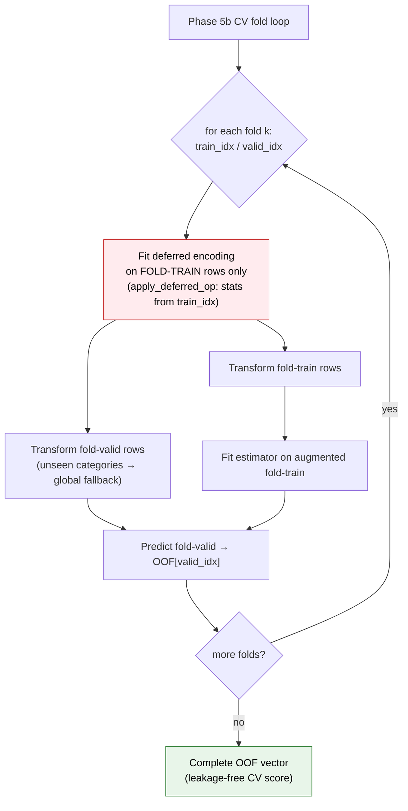
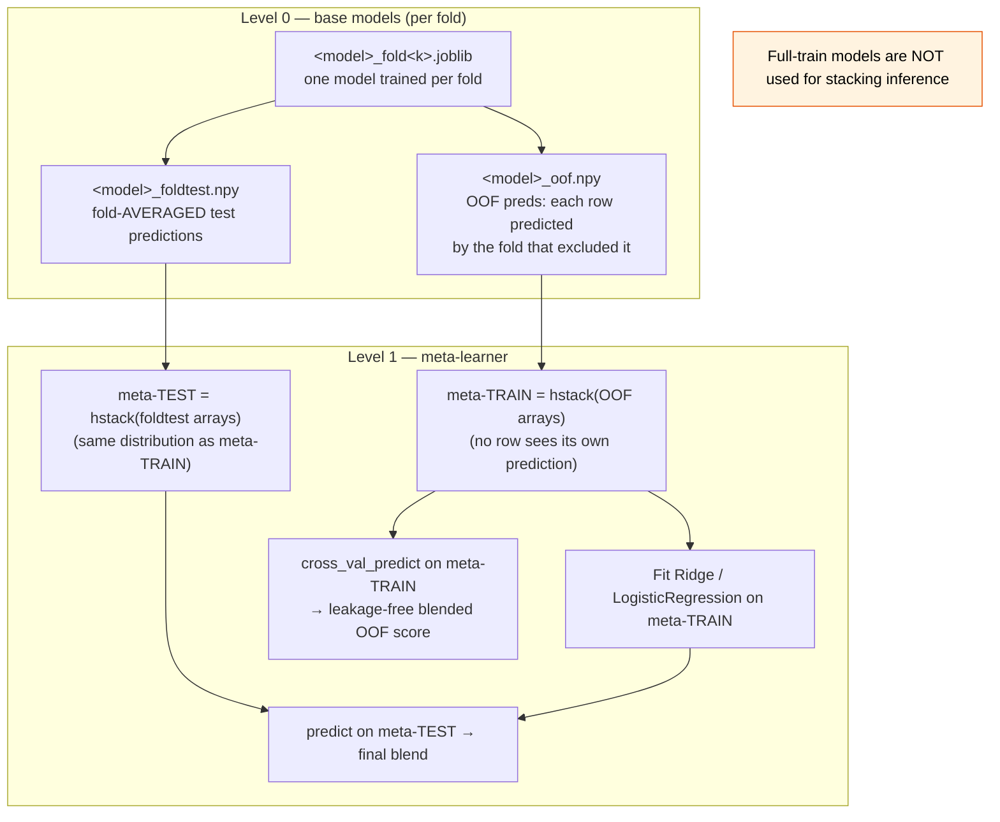
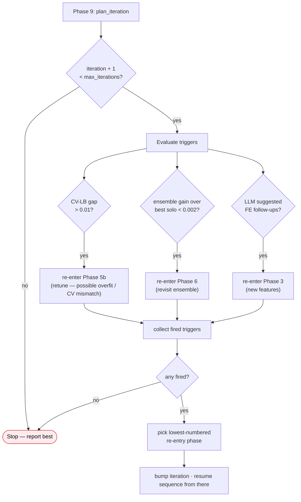
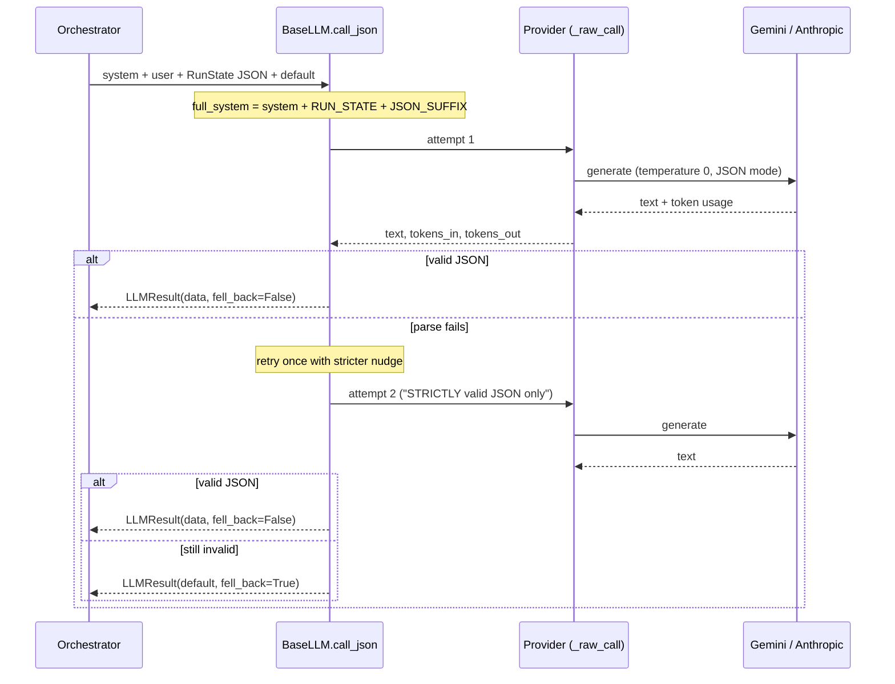
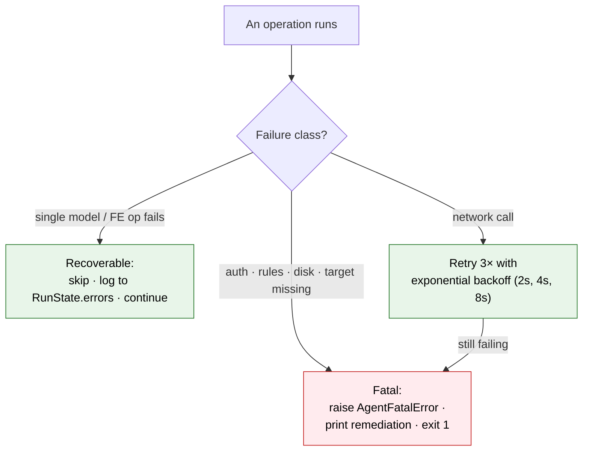

# Kaggle Auto Competitor

An autonomous, LLM-driven agent that takes a Kaggle competition URL and runs the
full modeling loop end to end: **download → EDA → feature engineering → model
selection → Optuna-tuned cross-validation → ensembling → submission → leaderboard
tracking → conditional iteration.**

The design splits responsibilities deliberately. LLM decisions are made only at
the genuinely ambiguous steps — EDA interpretation, feature strategy, model
ranking, ensemble choice — while the deterministic mechanics (cross-validation,
encoding, validation, post-processing) are plain, tested code. The LLM provider is
pluggable (`LLM_PROVIDER`): Google Gemini by default, Anthropic Claude optional.

> **Philosophy in one line:** maximize leaderboard score within the compute and
> submission budget, prefer well-understood methods over novelty, and *never*
> leak — a higher CV score from a leaky pipeline is worse than an honest lower one.

---

## Table of Contents

- [Why this exists](#why-this-exists)
- [Install](#install)
- [Usage](#usage)
- [System Architecture](#system-architecture)
- [The Nine-Phase Pipeline](#the-nine-phase-pipeline)
- [RunState: the single source of truth](#runstate-the-single-source-of-truth)
- [Leakage prevention: in-fold encoding](#leakage-prevention-in-fold-encoding)
- [Stacking: the corrected two-level CV scheme](#stacking-the-corrected-two-level-cv-scheme)
- [The iteration loop (Phase 9)](#the-iteration-loop-phase-9)
- [LLM integration](#llm-integration)
- [Module map](#module-map)
- [Configuration reference](#configuration-reference)
- [Run directory layout](#run-directory-layout)
- [Error handling model](#error-handling-model)
- [Research references](#research-references)
- [Development](#development)

---

## Why this exists

Competitive tabular ML is mostly a fixed recipe — clean validation, strong
gradient-boosted trees, careful feature engineering, and a blend — punctuated by
a handful of *judgement calls* that depend on the specific dataset. This project
automates the recipe and delegates only the judgement calls to an LLM, keeping
every numerically-sensitive step (the parts where a subtle bug silently inflates
your CV score) as auditable, deterministic Python.

---

## Install

```bash
uv sync                # full stack (ML libs are heavy)
cp .env.example .env   # then fill in credentials
```

Required credentials in `.env`:

- An LLM key — `GEMINI_API_KEY` by default (free key at
  [aistudio.google.com/apikey](https://aistudio.google.com/apikey)), **or** set
  `LLM_PROVIDER=anthropic` and provide `ANTHROPIC_API_KEY`.
- `KAGGLE_USERNAME` and `KAGGLE_KEY`.

Never commit `.env`.

---

## Usage

```bash
# Full pipeline (no auto-submit by default — generates a submission file only)
python -m agent run "https://www.kaggle.com/competitions/<slug>"

# Enable automatic submission to Kaggle
python -m agent run <url> --submit

# Resume from the last checkpoint / discard stale state
python -m agent resume <slug>
python -m agent run <url> --force-restart

# Limit iterations, raise log verbosity
python -m agent run <url> --submit --max-iterations 1 --log-level DEBUG
```

By default the agent **does not submit** — pass `--submit` (or set
`auto_submit: true` in `configs/agent.yaml`) to upload. The effective daily
submission cap is always `min(SUBMISSION_DAILY_LIMIT, the competition's own limit)`.

---

## System Architecture

The system is a strict, one-directional dependency stack. The orchestrator owns
control flow and all side effects (file writes, logging, network); the `tools/`
modules are pure functions; `RunState` carries all cross-phase data. Tools never
import the orchestrator — this is a hard repository rule that keeps the layering
acyclic.



**Dependency direction (never violated):** `orchestrator → tools → memory`.
Shared types live in `memory.py`. There are no module-level mutable globals and
no singletons holding run data.

---

## The Nine-Phase Pipeline

Nine phases run in order. After **every** phase, `RunState` is serialized to
`runs/<slug>/state.json` and a structured entry is appended to `run_log.md`.
This is what makes the run resumable and auditable.



> Phases shaded **purple** make an LLM call; **green** are the compute-heavy
> training phases; **orange** touch Kaggle's submission API.

| Phase | What it does | LLM? |
|------|--------------|:---:|
| 0 Bootstrap | Validate URL, credentials, rules acceptance, disk space, high-stakes guard | — |
| 1 Ingestion | Download, unzip, detect train/test/sample_submission | — |
| 2 EDA | Typing, target/id column ID, time-series + leakage detection, LLM analysis | ✓ |
| 3 Feature Engineering | 15-op registry; immediate ops now, deferred encodings stored for in-fold use | ✓ |
| 4 Model Selection | LLM-ranked models, filtered + GBM hard rule, neural gate | ✓ |
| 5a Pruning | Importance probe → prune to `max_features` | — |
| 5b Training | Optuna search per model; deferred encodings fit **in-fold** | — |
| 6 Ensembling | Weighted avg / rank avg / stacking (fold-averaged test preds) | ✓ |
| 7 Submission | Map predictions to sample format, post-process, validate | — |
| 8 Leaderboard | Submit best file, poll for public score | — |
| 9 Iteration | Re-enter a specific earlier phase if a trigger fires | — |

---

## RunState: the single source of truth

`RunState` (a Pydantic model in [agent/memory.py](agent/memory.py)) is the only
channel through which data crosses a phase boundary. Phase outputs are **never**
passed through side channels, module-level caches, or return values that skip
serialization. Each phase reads what it needs from `RunState`, does its work, and
writes its results back; the orchestrator then persists the whole object.



On resume, `RunState.load()` checks `state_version` (currently `"1.1"`) **first**.
A mismatch raises `StateVersionMismatchError` — there is no silent migration; you
must `--force-restart`. This guarantees you never resume into a schema the code no
longer understands.

---

## Leakage prevention: in-fold encoding

This is the single most important correctness property in the system. Target- and
group-based encodings (`target_encode`, `group_mean_encode`, `group_std_encode`)
must *never* be fit on the full training set, because every row would then carry
information from its own label — inflating CV and collapsing on the leaderboard.

These three operations are classified as **deferred ops**. In Phase 3 they are
validated and stored in `RunState.deferred_fe_ops` but *not executed*. They are
fit **inside the CV fold loop** in Phase 5b, on each fold's training rows only,
then applied to that fold's validation rows. Attempting to run a deferred op
through the immediate executor raises `DeferredOpError`.



**Contrast with immediate ops** (`log_transform`, `interaction_multiply`,
`datetime_parts`, `tfidf_svd`, …): these are deterministic or fit only on feature
statistics, so they run once in Phase 3, fit on train and applied to test, with no
fold dependence. The full 15-operation registry lives in
[agent/tools/feature_engineering.py](agent/tools/feature_engineering.py).

> Tests assert this directly: `target_encode` / `group_mean_encode` /
> `group_std_encode` **must** raise `DeferredOpError` if invoked outside the CV
> fold context. See [tests/test_feature_engineering.py](tests/test_feature_engineering.py).

---

## Stacking: the corrected two-level CV scheme

Naive stacking leaks in a subtle way: if the meta-learner's test features come
from models retrained on the *full* training set, while its train features come
from out-of-fold predictions, the two feature distributions are inconsistent and
the meta-model is mis-calibrated. This implementation uses the corrected scheme.



Key invariants (enforced in [agent/tools/ensembler.py](agent/tools/ensembler.py)):

- Meta-learner **train** features = the OOF prediction matrix from the per-fold
  models — no row ever sees a prediction from a model that trained on it.
- Meta-learner **test** features = each base model's *fold-averaged* test
  predictions (`<model>_foldtest.npy`), keeping train/test feature distributions
  consistent.
- The blended OOF score itself is computed via `cross_val_predict` on the OOF
  stack, so even the reported blend score is leakage-free.

The other blending strategies — `weighted_average` (softmax over CV scores),
`rank_average` (mean of percentile ranks), and `none` (pick the single best
model) — are simpler and used as robust fallbacks when stacking inputs are
unusable or there are too few models.

---

## The iteration loop (Phase 9)

After a full pass, Phase 9 inspects the run and decides whether to re-enter an
earlier phase. Each trigger maps to a re-entry point; the **lowest-numbered**
phase wins so the most upstream fix is applied first. The loop stops when no
trigger fires or the iteration budget (`max_iterations`) is exhausted.



---

## LLM integration

The LLM is invoked at exactly four decision points (EDA analysis, FE strategy,
model ranking, ensemble method). Every call goes through one shared path in
[agent/llm.py](agent/llm.py) that makes LLM output safe to consume:



Design choices that follow from "minimize LLM calls" and "fail loudly, recover
gracefully":

- **RunState is passed as compact JSON in the system prompt** so the model
  reasons with current run context — but only a small, hand-picked subset
  (`_state_context`) to keep prompts cheap.
- **JSON-only output is enforced**, parse failure retries once, then falls back
  to a caller-supplied deterministic default. A bad LLM response can never crash a
  phase — it degrades to a sensible heuristic.
- **Token usage is accumulated** and written into `RunState.total_tokens_used`
  and the run log.
- **Provider is pluggable** via `build_llm(settings)`: `GeminiLLM` (default) and
  `LLMClient` (Anthropic, `claude-sonnet-4-6`). Both share `call_json`; only the
  raw transport differs, and the SDK client is injectable so tests need no key.

---

## Module map

| Module | Role |
|---|---|
| [agent/orchestrator.py](agent/orchestrator.py) | Top-level phase sequencer; drives the 9-phase loop, owns `RunState` & side effects |
| [agent/memory.py](agent/memory.py) | `RunState` Pydantic model + serialization to `state.json` |
| [agent/llm.py](agent/llm.py) | `BaseLLM.call_json`, `GeminiLLM`, `LLMClient` (Anthropic), `build_llm` factory |
| [agent/config.py](agent/config.py) | Typed `Settings` (env) + `AgentConfig` (yaml) + model search spaces |
| [agent/run_log.py](agent/run_log.py) | Structured `run_log.md` writer (one entry per phase) |
| [agent/tools/kaggle_api.py](agent/tools/kaggle_api.py) | Download, submit, leaderboard poll, metadata fetch |
| [agent/tools/ingest.py](agent/tools/ingest.py) | Unzip, detect canonical train/test/sample files |
| [agent/tools/eda.py](agent/tools/eda.py) | Profiling, leakage detection, time-series detection |
| [agent/tools/feature_engineering.py](agent/tools/feature_engineering.py) | 15-operation FE registry; immediate + deferred in-fold ops |
| [agent/tools/model_selector.py](agent/tools/model_selector.py) | Task inference, catalog filtering, GBM hard rule, neural gate |
| [agent/tools/trainer.py](agent/tools/trainer.py) | Optuna-driven CV loop; k-fold + full-train model output |
| [agent/tools/ensembler.py](agent/tools/ensembler.py) | Weighted avg, rank avg, stacking (corrected CV scheme) |
| [agent/tools/submitter.py](agent/tools/submitter.py) | Format validation, post-processing, submission record |
| [configs/agent.yaml](configs/agent.yaml) | Behaviour flags (auto_submit, max_iterations, Optuna timeouts) |
| [configs/models.yaml](configs/models.yaml) | Hyperparameter search spaces per model |

---

## Configuration reference

All tunables live in `configs/agent.yaml`, `configs/models.yaml`, or a documented
env var — there is no hidden configuration and no magic numbers buried in code.
Config is loaded into typed objects once at bootstrap and passed down; it is never
re-read mid-run.

**Environment** (`.env`):

| Variable | Default | Meaning |
|---|---|---|
| `LLM_PROVIDER` | `gemini` | `gemini` \| `anthropic` |
| `GEMINI_API_KEY` / `ANTHROPIC_API_KEY` | — | LLM key (required for the active provider) |
| `KAGGLE_USERNAME` + `KAGGLE_KEY` | — | Kaggle API credentials (required) |
| `GEMINI_MODEL` | `gemini-2.0-flash` | Gemini model id |
| `AGENT_MODEL` | `claude-sonnet-4-6` | Anthropic model id |
| `AGENT_MAX_TOKENS` | `8192` | Max output tokens per LLM call |
| `OPTUNA_N_TRIALS` | `50` | Overrides `agent.yaml` when set |
| `SUBMISSION_DAILY_LIMIT` | `5` | Personal cap; Kaggle's API limit is always authoritative |
| `LOG_LEVEL` | `INFO` | Log verbosity |

**Behaviour** ([configs/agent.yaml](configs/agent.yaml)): `auto_submit` (false),
`max_iterations` (3), `max_training_hours` (4), `allow_neural` (false), `cv_folds`
(5), `cv_seed` (42), `optuna_n_trials` (50), `optuna_timeout` (3600s per model),
`max_features` (2000), `min_models_for_ensemble` (2), `ensemble_fallback`
(`weighted_average`), `lb_poll_timeout_minutes` (10).

Everything is **deterministic by default** — all randomness uses `cv_seed`.

---

## Run directory layout

Everything an execution produces lives under `runs/<slug>/`. The agent never
writes outside this directory at runtime.

```
runs/<slug>/
├── state.json              # serialized RunState (written after every phase)
├── run_log.md              # human-readable structured log, one entry per phase
├── eda_analysis.json       # LLM EDA output
├── eda_report.html         # optional profiling report (save_plots)
├── leaderboard.json        # leaderboard history
├── raw/                    # downloaded + unzipped competition data
├── processed/              # train_fe_base.parquet, test_fe_base.parquet
├── models/                 # <model>_oof.npy, _test.npy, _foldtest.npy,
│                           # _fold<k>.joblib, _fulltrain.joblib, ensemble_test.npy
└── submissions/            # generated submission CSVs (timestamped, CV-scored)
```

---

## Error handling model



The principle is **fail loud at boundaries, recover gracefully within**. A single
failed FE operation or model is skipped and logged; a phase-boundary failure is
classified, logged, and either recovered or raised. A partial run that completes
with logged errors is strictly better than a silent crash or a silently-wrong
result.

---

## Research references

The pipeline is an engineering synthesis of well-established, peer-reviewed
methods rather than novel research. Each major design decision traces back to a
specific paper or canonical source; the table below maps the technique used in
this repo to the work it is based on.

| Technique in this repo | Where | Reference |
|---|---|---|
| **Gradient-boosted trees as the default tabular learner** | `model_selector` GBM hard rule, `trainer` | Chen & Guestrin, *XGBoost: A Scalable Tree Boosting System*, KDD 2016. [arXiv:1603.02754](https://arxiv.org/abs/1603.02754) |
| **Leaf-wise histogram boosting (LightGBM)** | primary GBM in `trainer` | Ke et al., *LightGBM: A Highly Efficient Gradient Boosting Decision Tree*, NeurIPS 2017. [paper](https://papers.nips.cc/paper/2017/hash/6449f44a102fde848669bdd9eb6b76fa-Abstract.html) |
| **Ordered boosting & categorical handling (CatBoost)** | optional GBM in `trainer` | Prokhorenko et al., *CatBoost: unbiased boosting with categorical features*, NeurIPS 2018. [arXiv:1706.09516](https://arxiv.org/abs/1706.09516) |
| **Stacked generalization (meta-learning on OOF preds)** | `ensembler.stacking` | Wolpert, *Stacked Generalization*, Neural Networks, 1992. [doi:10.1016/S0893-6080(05)80023-1](https://doi.org/10.1016/S0893-6080(05)80023-1) |
| **Out-of-fold stacking with leakage-safe meta features** | corrected two-level CV scheme | Töscher, Jahrer & Bell, *The BigChaos Solution to the Netflix Grand Prize*, 2009. [pdf](https://www.netflixprize.com/assets/GrandPrize2009_BPC_BigChaos.pdf) |
| **Bagging / Random Forests as a diversity model** | `RandomForest*` in catalog | Breiman, *Random Forests*, Machine Learning, 2001. [doi:10.1023/A:1010933404324](https://doi.org/10.1023/A:1010933404324) |
| **Target / mean encoding of high-cardinality categoricals** | `target_encode` (in-fold, smoothed) | Micci-Barreca, *A Preprocessing Scheme for High-Cardinality Categorical Attributes*, SIGKDD Explorations, 2001. [doi:10.1145/507533.507538](https://doi.org/10.1145/507533.507538) |
| **In-fold encoding to avoid target leakage** | deferred ops in `feature_engineering` + `trainer` | Kaufman, Rosset & Perlich, *Leakage in Data Mining*, KDD 2011 / TKDD 2012. [doi:10.1145/2382577.2382579](https://doi.org/10.1145/2382577.2382579) |
| **Bayesian/TPE hyperparameter optimization** | Optuna search in `trainer` | Bergstra et al., *Algorithms for Hyper-Parameter Optimization*, NeurIPS 2011. [paper](https://papers.nips.cc/paper/2011/hash/86e8f7ab32cfd12577bc2619bc635690-Abstract.html) |
| **Optuna framework & pruning** | study-level `optimize` + early-stop callback | Akiba et al., *Optuna: A Next-generation Hyperparameter Optimization Framework*, KDD 2019. [arXiv:1907.10902](https://arxiv.org/abs/1907.10902) |
| **K-fold / stratified cross-validation as the validation signal** | `make_cv` | Kohavi, *A Study of Cross-Validation and Bootstrap for Accuracy Estimation and Model Selection*, IJCAI 1995. [pdf](https://www.ijcai.org/Proceedings/95-2/Papers/016.pdf) |
| **Forward-chaining CV for temporal data** | `TimeSeriesSplit` when `is_time_series` | Bergmeir & Benítez, *On the use of cross-validation for time series predictor evaluation*, Information Sciences, 2012. [doi:10.1016/j.ins.2011.12.028](https://doi.org/10.1016/j.ins.2011.12.028) |
| **Permutation feature importance for pruning** | `probe_feature_importance` fallback | Breiman (2001, above); Altmann et al., *Permutation importance: a corrected feature importance measure*, Bioinformatics 2010. [doi:10.1093/bioinformatics/btq134](https://doi.org/10.1093/bioinformatics/btq134) |
| **TF-IDF + truncated SVD (LSA) for text features** | `tfidf_svd` immediate op | Deerwester et al., *Indexing by Latent Semantic Analysis*, JASIS 1990. DOI: `10.1002/(SICI)1097-4571(199009)41:6<391::AID-ASI1>3.0.CO;2-9` |
| **Rank averaging of model outputs** | `ensembler.rank_average` | Caruana et al., *Ensemble Selection from Libraries of Models*, ICML 2004. [doi:10.1145/1015330.1015432](https://doi.org/10.1145/1015330.1015432) |
| **LLM-as-orchestrator / tool-using agent loop** | `orchestrator` + `llm.call_json` | Yao et al., *ReAct: Synergizing Reasoning and Acting in Language Models*, ICLR 2023. [arXiv:2210.03629](https://arxiv.org/abs/2210.03629) |
| **Autonomous ML pipeline construction (AutoML lineage)** | overall agent design | Feurer et al., *Efficient and Robust Automated Machine Learning (auto-sklearn)*, NeurIPS 2015. [paper](https://papers.nips.cc/paper/2015/hash/11d0e6287202fced83f79975ec59a3a6-Abstract.html) |

> These are *reference implementations of established ideas*, adapted to a single
> auditable agent. The contribution here is the integration — leakage-safe
> wiring, resumable state, and LLM-gated judgement calls — not the underlying
> algorithms.

---

## Development

```bash
pytest tests/ --cov=agent --cov-report=term-missing   # 80% coverage gate
pytest tests/test_trainer.py -v                        # one module
pytest tests/test_eda.py::test_timeseries_detection -v # one test
```

Tests run entirely against mocked Kaggle/LLM APIs — no credentials or network
needed. The testing rule is contractual: no phase logic, tool module, or
`RunState` schema change merges without a corresponding test, and leakage is
tested directly (deferred ops must raise `DeferredOpError` outside the fold
context). Any change to phase ordering updates
[tests/test_orchestrator.py](tests/test_orchestrator.py) in the same change.
</content>
</invoke>
